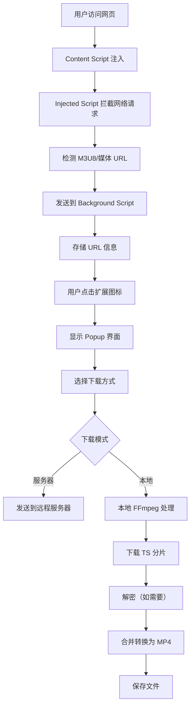

# M3U8 Keeper - 专业的M3U8视频流下载扩展

<div align="center">
  
  
  [](https://chrome.google.com/webstore)
  [](https://developer.mozilla.org/en-US/docs/Web/JavaScript)
  [](LICENSE)
</div>

## 📖 简介

M3U8 Keeper 是一款功能强大的 Chrome 浏览器扩展，专门用于捕获、管理和下载 HLS (HTTP Live Streaming) 视频流。支持自动检测 M3U8 流媒体、加密视频解密、本地视频处理等专业功能。

### 🌟 核心优势

- **智能捕获** - 自动检测并捕获页面中的 M3U8 流媒体 URL
- **双重下载模式** - 支持服务器端和本地客户端两种下载方式
- **加密视频支持** - 内置 AES-128 解密，支持加密 HLS 流
- **实时进度追踪** - 可视化显示每个 TS 分片的下载进度
- **格式自动转换** - 使用 FFmpeg.wasm 自动转换为 MP4 格式
- **多语言支持** - 支持中文和英文界面，自动检测浏览器语言

## 🚀 快速开始

### 安装方式

#### 方式一：开发者模式安装（推荐）

1. **下载扩展文件**
   ```bash
   git clone https://github.com/xuqssq/download-m3u8-chrome-ext.git
   ```

2. **打开 Chrome 扩展管理页面**
   - 在地址栏输入：`chrome://extensions/`
   - 或通过菜单：设置 → 扩展程序

3. **启用开发者模式**
   - 打开页面右上角的"开发者模式"开关

4. **加载扩展**
   - 点击"加载已解压的扩展程序"
   - 选择项目根目录（包含 manifest.json 的文件夹）

5. **完成安装**
   - 扩展图标将出现在浏览器工具栏
   - 如果没有显示，点击扩展图标并固定 M3U8 Keeper

#### 方式二：UserScript 安装（备选）

如果您使用 Tampermonkey 或类似的用户脚本管理器：

1. 安装 [Tampermonkey](https://www.tampermonkey.net/)
2. 打开项目中的 `code.js` 文件
3. 复制内容到 Tampermonkey 创建新脚本
4. 保存并启用脚本

## 📚 详细使用指南

### 基础使用流程

#### 1. 捕获视频 URL

- **自动捕获**：访问包含视频的网页，扩展会自动检测 M3U8 流
- **手动检查**：点击扩展图标查看已捕获的 URL 列表
- **URL 管理**：
  - 🗑️ 删除单个 URL
  - 🧹 清空所有 URL
  - 📋 复制 URL 到剪贴板

#### 2. 下载视频

##### 服务器下载模式
- **优点**：
  - 下载速度快
  - 服务器端处理，节省本地资源
  - 适合大文件下载
- **使用场景**：稳定网络环境，无特殊加密的视频

##### 本地下载模式
- **优点**：
  - 完全本地处理，保护隐私
  - 支持复杂加密视频
  - 无需依赖外部服务器
- **使用场景**：加密视频、隐私敏感内容、服务器不可用时

#### 3. 进度监控

下载页面提供详细的进度信息：
- **总体进度条** - 显示整体下载完成度
- **TS 分片网格** - 每个方块代表一个视频分片
  - 🟦 蓝色：下载中
  - 🟩 绿色：已完成
  - ⬜ 灰色：等待中
  - 🟥 红色：下载失败
- **实时状态** - 显示当前操作（解析、下载、转换、保存）

### 高级功能

#### 🔐 加密视频处理

支持 AES-128 加密的 HLS 流：
- 自动检测加密信息
- 获取解密密钥
- 实时解密 TS 分片
- 无缝转换为标准 MP4

#### 🌍 多语言切换

1. 点击扩展图标
2. 点击右上角语言切换按钮（🌐）
3. 选择所需语言：
   - 🇨🇳 中文
   - 🇺🇸 English

#### 🎨 开发工具

项目包含专业的图标生成工具：

**icon_size_generate.html** - 自定义尺寸图标生成器
- 上传原始图片
- 输入自定义宽高（1-1024像素）
- 批量生成多种尺寸
- 导出 PNG 和 ICO 格式

使用方法：
1. 在浏览器中打开 `icon_size_generate.html`
2. 上传高分辨率源图片
3. 自动生成标准尺寸（16x16, 32x32, 48x48, 128x128）
4. 添加自定义尺寸（如 512x512, 256x128 等）
5. 批量导出或生成网站 favicon.ico

## 🏗️ 项目结构

```
M3U8Keeper/
├── manifest.json              # Chrome 扩展配置文件 (Manifest V3)
├── README.md                  # 项目文档
├── code.js                    # UserScript 版本
├── icon_size_generate.html    # 图标生成工具
│
├── lib/                       # 第三方库
│   ├── ffmpeg.min.js         # FFmpeg.wasm 主文件
│   ├── ffmpeg-core.js        # FFmpeg 核心库
│   ├── ffmpeg-core.wasm      # WebAssembly 二进制文件
│   └── ffmpeg-core.worker.js # Web Worker 处理脚本
│
├── src/                       # 源代码目录
│   ├── assets/               # 静态资源
│   │   ├── favicon.ico      # 网站图标
│   │   └── icons/           # 扩展图标
│   │       ├── icon16.png   # 16x16 工具栏图标
│   │       ├── icon32.png   # 32x32 图标
│   │       ├── icon48.png   # 48x48 图标
│   │       └── icon128.png  # 128x128 商店图标
│   │
│   ├── background/           # 后台服务
│   │   └── background.js    # Service Worker，管理扩展生命周期
│   │
│   ├── content/              # 内容脚本
│   │   ├── content.js       # 主内容脚本，页面交互
│   │   └── injected.js      # 注入脚本，网络请求拦截
│   │
│   ├── popup/                # 弹出窗口
│   │   ├── popup.html       # 弹窗界面
│   │   ├── popup.js         # 弹窗逻辑
│   │   └── styles.css       # 弹窗样式
│   │
│   ├── newtab/               # 下载管理页面
│   │   ├── newtab.html      # 下载页面界面
│   │   ├── newtab.js        # 下载管理逻辑
│   │   └── newtab-styles.css # 下载页面样式
│   │
│   └── utils/                # 工具模块
│       ├── i18n.js          # 国际化基础支持
│       ├── languageManager.js # 语言切换管理
│       └── localDownloader.js # 本地下载处理器
│
└── _locales/                  # 国际化资源
    ├── en/                   # 英文
    │   └── messages.json
    └── zh_CN/                # 简体中文
        └── messages.json
```

## 🛠️ 技术架构

### 核心技术栈

- **Frontend**: HTML5, CSS3, JavaScript (ES6+)
- **Extension API**: Chrome Extension Manifest V3
- **Video Processing**: FFmpeg.wasm
- **Encryption**: Web Crypto API (AES-128)
- **Storage**: Chrome Storage API
- **Internationalization**: Chrome i18n API

### 工作原理



## 🔧 配置与自定义

### 扩展权限说明

扩展需要以下权限：
- `storage` - 保存用户设置和 URL 列表
- `webRequest` - 监听网络请求
- `tabs` - 获取标签页信息
- `downloads` - 管理文件下载
- `<all_urls>` - 在所有网站运行（捕获视频流）

### 支持的视频格式

- **输入格式**：
  - M3U8 (HLS 播放列表)
  - TS (MPEG-2 传输流)
  - 加密 HLS (AES-128)
  
- **输出格式**：
  - MP4 (H.264 + AAC)

## 🐛 故障排除

### 常见问题

#### Q: 扩展没有捕获到视频 URL？
**A:** 请检查：
1. 确保视频正在播放
2. 刷新页面重新加载
3. 检查是否是支持的视频格式
4. 某些网站可能使用特殊加密或私有协议

#### Q: 本地下载失败？
**A:** 可能原因：
1. 视频使用了不支持的加密方式
2. 浏览器内存不足（大文件）
3. 跨域限制（CORS）
解决方案：尝试使用服务器下载模式

#### Q: 下载速度很慢？
**A:** 优化建议：
1. 使用服务器下载模式
2. 检查网络连接
3. 避免同时下载多个视频
4. 关闭其他占用带宽的应用

#### Q: 转换后的视频无法播放？
**A:** 请确认：
1. 原始视频是否完整
2. 使用支持 H.264 的播放器
3. 尝试使用 VLC 等通用播放器

### 错误代码说明

- `NETWORK_ERROR` - 网络连接问题
- `PARSE_ERROR` - M3U8 解析失败
- `DECRYPT_ERROR` - 解密失败
- `CONVERT_ERROR` - 格式转换失败
- `STORAGE_ERROR` - 存储空间不足

## 🤝 贡献指南

欢迎贡献代码、报告问题或提出建议！

### 开发环境设置

1. Fork 项目
2. 克隆到本地：
   ```bash
   git clone https://github.com/yourusername/M3U8Keeper.git
   cd M3U8Keeper
   ```
3. 在 Chrome 中加载未打包的扩展
4. 修改代码并测试
5. 提交 Pull Request

### 代码规范

- 使用 ES6+ 语法
- 保持代码整洁，添加必要注释
- 遵循现有代码风格
- 测试所有功能后再提交

## 📄 许可证

本项目采用 MIT 许可证 - 详见 [LICENSE](LICENSE) 文件

## 🙏 致谢

- [FFmpeg](https://ffmpeg.org/) - 强大的视频处理库
- [ffmpeg.wasm](https://github.com/ffmpegwasm/ffmpeg.wasm) - FFmpeg 的 WebAssembly 版本
- Chrome Extension 开发者社区

## 📮 联系方式

- 问题反馈：[GitHub Issues](https://github.com/xuqssq/download-m3u8-chrome-ext/issues)
- 功能建议：[GitHub Discussions](https://github.com/xuqssq/download-m3u8-chrome-ext/discussions)

---

<div align="center">
  Made with ❤️ by M3U8 Keeper Team
</div>